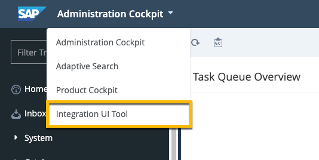
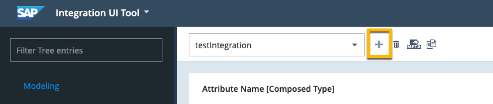

<!--
SPDX-FileCopyrightText: 2020 Pascal Barbier <pascal.barbier@sap.com>

SPDX-License-Identifier: Apache-2.0
-->

<!-- loio684da0ea889346fc9abf7c98a4c1d06a -->

<b>Table of Contents</b>

-   [Integrating Third-Party Applications](Integrating_Third-Party_Applications.md)
    -   [Define Integration Objects](Define_Integration_Objects.md)
        -   [Create an Integration Flow Triggered by SAP Commerce](Create_an_Integration_Flow_Triggered_by_SAP_Commerce.md)
            -   [Integration Scenarios: Commerce](Integration_Scenarios_Commerce.md)
        -   [Create an Integration Flow Triggered by SCPI](Create_an_Integration_Flow_Triggered_by_SCPI.md)
            -   [Integration Scenarios: SCPI](Integration_Scenarios_SCPI.md)

## Define Integration Objects

You create integration objects to define the data that SAP Commerce exports or imports.

***

Integration objects define an integration. Integrations create a GET endpoint and a POST endpoint that accepts one or more objects, and define the object’s payload. You can interact with them using an OData service, which is created automatically.

The following shows you how to create an integration object in Backoffice. You can also create simple integration objects using ImpEx. For more information, see **Creating a Simple Integration Object** at [https://help.sap.com/viewer/50c996852b32456c96d3161a95544cdb/1905/en-US/571f85d83c334f70b8b356e40730aedf.html?q=loio571f85d83c334f70b8b356e40730aedf](https://help.sap.com/viewer/50c996852b32456c96d3161a95544cdb/1905/en-US/571f85d83c334f70b8b356e40730aedf.html?q=loio571f85d83c334f70b8b356e40730aedf).

1.  In Backoffice, open the *Integration UI Tool*.

      

2.  In the menu on the left, click *Modeling*.

3.  Click  + \(Create Integration Object\) .

      

4.  Enter a name for the service.

    This information is important as it is used later in the service URL.

5.  Specify a root type.

    The root type determines what type of data is being exported.

    You can select a root type or create your own by creating a model in Backoffice.

6.  From the *Integration Type* list, select *Inbound*.

7.  Click *Create*.

8.  Select the attributes that are mandatory for your integration.

9.  Click *Save*.

***

The service is available at `https://localhost:9002/odata2webservices/<ServiceName>`.

***
[Next: Create an Integration Flow Triggered by SAP Commerce -->](Create_an_Integration_Flow_Triggered_by_SAP_Commerce.md)
