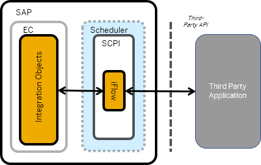
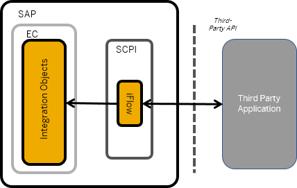
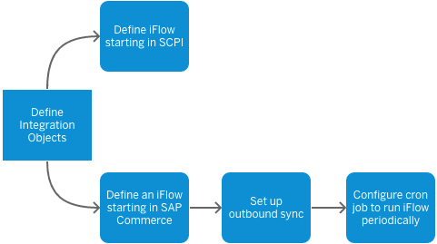

<!--
SPDX-FileCopyrightText: 2020 Pascal Barbier <pascal.barbier@sap.com>

SPDX-License-Identifier: Apache-2.0
-->

<!-- loioe8f2c4502c5b4790ba14b9cde3b47211 -->

<b>Table of Contents</b>

-   [Integrating Third-Party Applications](Integrating_Third-Party_Applications.md)
    -   [Define Integration Objects](Define_Integration_Objects.md)
        -   [Create an Integration Flow Triggered by SAP Commerce](Create_an_Integration_Flow_Triggered_by_SAP_Commerce.md)
            -   [Integration Scenarios: Commerce](Integration_Scenarios_Commerce.md)
        -   [Create an Integration Flow Triggered by SCPI](Create_an_Integration_Flow_Triggered_by_SCPI.md)
            -   [Integration Scenarios: SCPI](Integration_Scenarios_SCPI.md)

## Integrating Third-Party Applications

You integrate third-party applications with SAP Commerce using SAP Cloud Platform Integration \(SCPI\).

You use integration objects to expose OData endpoints that allow SAP Commerce and SCPI to exchange data. Integration flows in SCPI call third-party applications using an API. The integration varies slightly depending on whether SAP Commerce or SCPI starts the data exchange.

   

Integration Model: SAP Commerce Requests Data from the External Service <a name="loioe8f2c4502c5b4790ba14b9cde3b47211__fig_x3j_hph_cjb"/>

  

This model is useful if you have data in commerce that you want the service to react to. For example, if there is a new order created in SAP Commerce and you want to collect data for that order from the service. In this scenario, you need to run the iFlow using cron jobs to make sure that the job runs regularly. SCPI does not explicitly know when something happens in SAP Commerce, so you must set up the outbound sync function in the Integration API module.

   

Integration Model: SCPI Requests Data from the External Service <a name="loioe8f2c4502c5b4790ba14b9cde3b47211__fig_fjf_khr_kjb"/>

  

This model is useful if you want to regularly update information in SAP Commerce. SCPI has its own way of running iFlows on a timer. Therefore, you do not need the scheduler to run the iFlows in this model.

***

<a name="loioe8f2c4502c5b4790ba14b9cde3b47211__section_qym_d2r_kjb"/>

### Integration Setup

Similarly, the process for integrating the two systems varies depending on whether SAP Commerce or SCPI starts the process. The following image shows a high-level overview of the step required to set up the integration.

   

Process Flow: Setting Up the Integration<a name="loioe8f2c4502c5b4790ba14b9cde3b47211__fig_b3z_djr_kjb"/>

  

***

<a name="loioe8f2c4502c5b4790ba14b9cde3b47211__section_l4t_vtz_fjb"/>

### Prerequisites

-   You have installed the Integration API module for SAP Commerce. For more information, see **Installing the Integration Extensions** at [https://help.sap.com/viewer/50c996852b32456c96d3161a95544cdb/1905/en-US/9af51e8010034ac7bda41a3486196894.html](https://help.sap.com/viewer/50c996852b32456c96d3161a95544cdb/1905/en-US/9af51e8010034ac7bda41a3486196894.html).

-   You have an SAP Cloud Platform Integration subscription.

-   The third-party solution provides its services over an API.

***

[Next: Define Integration Objects -->](Define_Integration_Objects.md)
