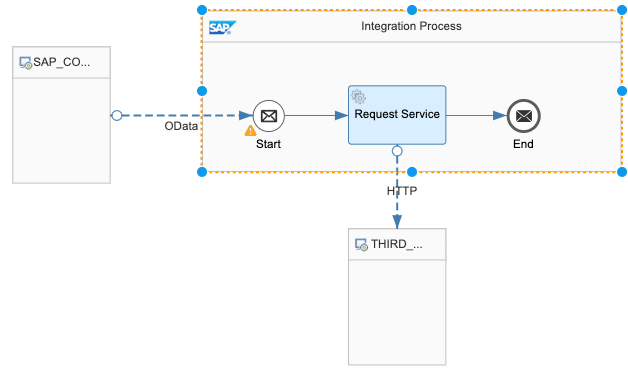
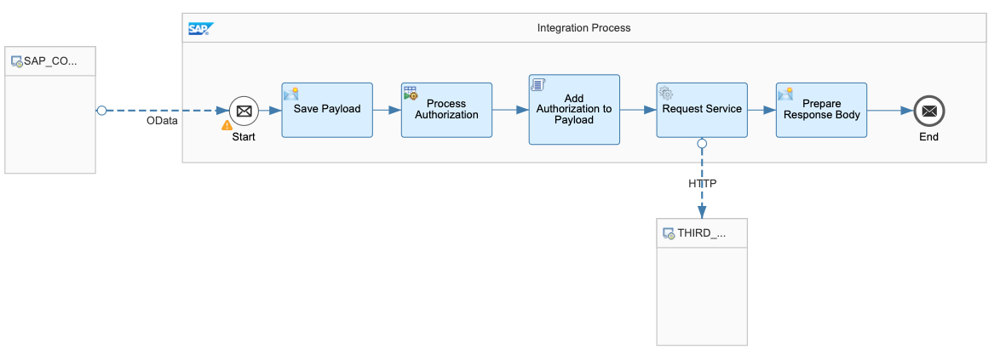
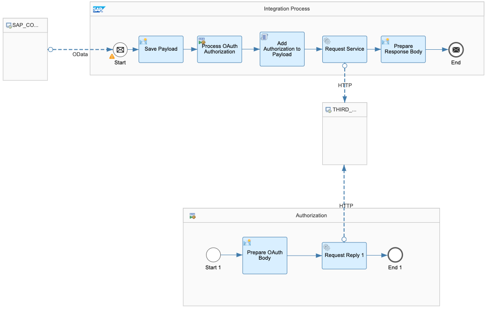

<!-- loio3f856fe608ef407cb10597bbb1878bd2 -->

<b>Table of Contents</b>

-   [Integrating Third-Party Applications](Integrating_Third-Party_Applications.md)
    -   [Define Integration Objects](Define_Integration_Objects.md)
        -   [Create an Integration Flow Triggered by SAP Commerce](Create_an_Integration_Flow_Triggered_by_SAP_Commerce.md)
            -   [Integration Scenarios: Commerce](Integration_Scenarios_Commerce.md)
        -   [Create an Integration Flow Triggered by SCPI](Create_an_Integration_Flow_Triggered_by_SCPI.md)
            -   [Integration Scenarios: SCPI](Integration_Scenarios_SCPI.md)

## Integration Scenarios: Commerce

SAP Cloud Platform Integration \(SCPI\) allows you to configure any integration flow that you need. There are some common scenarios that can be used as a starting point for your integration.

> Note:
> Use the following scenarios as a basis for your integration. These examples are not complete and are not intended to offer a comprehensive guide to all of the tools offered by SCPI.
> 
> For more information, see **Creating an Integration Flow** at [https://help.sap.com/viewer/DRAFT/368c481cd6954bdfa5d0435479fd4eaf/IAT/en-US/da53d93cd8fb47ff9ea55b6b278cd85e.html](https://help.sap.com/viewer/DRAFT/368c481cd6954bdfa5d0435479fd4eaf/IAT/en-US/da53d93cd8fb47ff9ea55b6b278cd85e.html).
> 
> 

In each of these scenarios, because outbound sync is active, the calls to SCPI are all synchronous. You do not have to explicitly send the response back to SAP Commerce.

***

<a name="loio3f856fe608ef407cb10597bbb1878bd2__section_hjy_s5t_3jb"/>

### No Authorization/No Data Transformation

Your service does not require any authorization and accepts data in the format delivered by SAP Commerce.

  

The integration flow receives the payload, passes it on to the third party, and returns the response to commerce.

***

### No Authorization/With Data Transformation

If your service is public and you do not require any authorization to connect to it but the service accepts messages in a different format to the one sent by SAP Commerce, you have to use SCPI to convert the data. If your service is public and you do not require any authorization to connect to it and the data that is sent by commerce can be received in the same format by the service, you can create a simple process flow.

The following is a simple example that uses a script to convert the data; however, SCPI has many tools that you can use to prepare your payload and response.

  

The payload is received by SCPI, is converted and is passed on to the service. To send the data back to SAP Commerce, you must convert the data back to its original format. For example, you could use a script that performs the conversions or one of the data converters provided.

***

<a name="loio3f856fe608ef407cb10597bbb1878bd2__section_cg4_mwt_3jb"/>

### Basic Authentication/With Data Transformation

If your service requires basic authentication, you have to build this into the integration flow. Because iFlows can only save one message at a time, you have to save the payload before you can do any other processes. You can do this in a message converter, by assigning the body of the message to a variable. Then you can get access to the service and combine with the payload if necessary.

  

If your service is public and you do not require any authorization to connect to it and the data that is sent by commerce can be received in theSCPI receives the payload and saves it. It then generates any keys required to access the service. Finally, it combines the two into a final payload and sends it to the service.

***

<a name="loio3f856fe608ef407cb10597bbb1878bd2__section_g4h_pwt_3jb"/>

### OAuth / With Data Transformation

If your service requires OAuth authorization, you can call this in a separate local process. In this example, you save the payload and call a local process, which obtains an OAuth token.

  

SCPI receives the payload and saves it. It then generates the OAuth required to access the service. Finally, it combines the two into a final payload and sends it to the service.
***

[Next: Create an Integration Flow Triggered by SCPI -->](Create_an_Integration_Flow_Triggered_by_SCPI.md)
