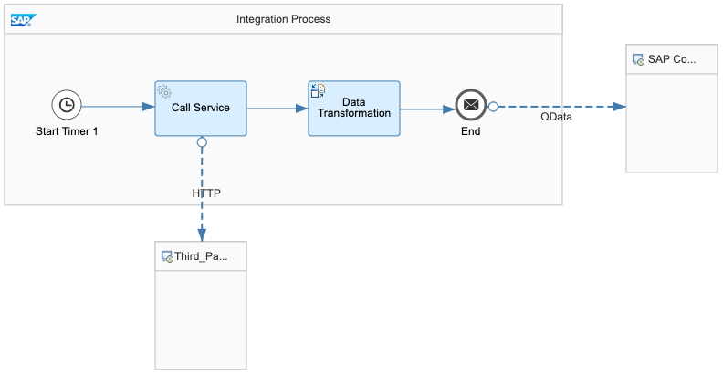

<!--
SPDX-FileCopyrightText: 2020 Pascal Barbier <pascal.barbier@sap.com>

SPDX-License-Identifier: Apache-2.0
-->

<!-- loio9334f0957b5e42939b7a555d12e89c6e -->

<b>Table of Contents</b>

-   [Integrating Third-Party Applications](Integrating_Third-Party_Applications.md)
    -   [Define Integration Objects](Define_Integration_Objects.md)
        -   [Create an Integration Flow Triggered by SAP Commerce](Create_an_Integration_Flow_Triggered_by_SAP_Commerce.md)
            -   [Integration Scenarios: Commerce](Integration_Scenarios_Commerce.md)
        -   [Create an Integration Flow Triggered by SCPI](Create_an_Integration_Flow_Triggered_by_SCPI.md)
            -   [Integration Scenarios: SCPI](Integration_Scenarios_SCPI.md)

## Integration Scenarios: SCPI

SAP Cloud Platform Integration \(SCPI\) allows you to configure any integration flow \(iFlow\) that you need. There are some common scenarios that can be used as a starting point for your integration.

> Note:
> Use the following scenarios as a basis for your integration. These examples are not complete and are not intended to offer a comprehensive guide to all of the tools offered by SCPI.
> 
> For more information, see **Creating an Integration Flow** at [https://help.sap.com/viewer/DRAFT/368c481cd6954bdfa5d0435479fd4eaf/IAT/en-US/da53d93cd8fb47ff9ea55b6b278cd85e.html](https://help.sap.com/viewer/DRAFT/368c481cd6954bdfa5d0435479fd4eaf/IAT/en-US/da53d93cd8fb47ff9ea55b6b278cd85e.html).
> 
> 

***

<a name="loio9334f0957b5e42939b7a555d12e89c6e__section_s3n_psr_kjb"/>

### Collecting Data from a Service

You start the process using the start time function in SCPI. You configure how often the iFlow runs. In this example, there is no sender as SCPI starts the process itself. Instead, both the third-party service and SAP Commerce are recipients. For the third party, you use the service URL for the API and for SAP Commerce, you use the OAuth service API provided when you created your integration objects.

  

***

*There are no further pages*
